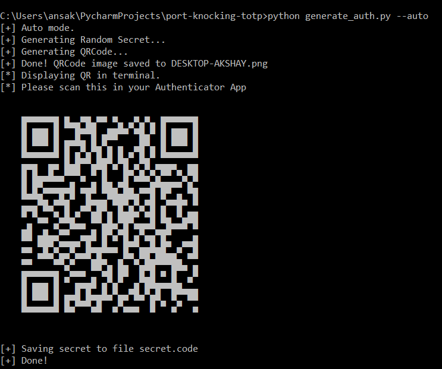

# Port Knocking
This repository contains Proof of Concepts for Port Knocking in two modes: On Linux using `iptables` and `knockd` and on AWS using security groups. The underlying mechanism to knock the ports is same for both the modes.<br>

Repository Structure:
```
aws/          -     Port Knocking using AWS.
knockd/       -     Port Knocking for Linux using IPTABLES and Knockd
```

Please look into each folder for detailed setup instructions for the required mode.

## Screenshots


## Usage
```
usage: generate_auth.py [-h] [-qr] [-H HOSTNAME] [-s SECRET] [-o OUTFILE] [-a]

Utility to generate QRCode Image and a random base32 secret that will be used
by the knocker program and can also be scanned by the Google Authenticator
App.

optional arguments:
  -h, --help            show this help message and exit
  -qr, --only-qr        Specify to only generate QRCode Image. Requires
                        --secret.
  -H HOSTNAME, --hostname HOSTNAME
                        Hostname of the machine.
  -s SECRET, --secret SECRET
                        Specified secret to use for creating QRCode Image.
  -o OUTFILE, --outfile OUTFILE
                        Name of file where the generated SECRET will be
                        stored. Default is 'secret.code'
  -a, --auto            Auto mode. Run with default settings

```

## Further Reading

